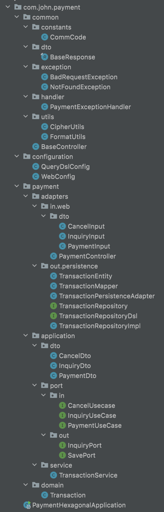

# payment-hexagonal
java17, Spring boot 3.0, hexagonal 아키텍처를 이용한 결제시스템

---

### 목차

* [개발환경](#개발환경)
* [테이블 설계](#테이블설계)
* [패키지구조](#패키지구조)

---

### 개발환경

1. BE
    * java 17
    * Spring boot 3.0.0
    * jpa (querydsl)
    * gradle
2. DB
    * h2
3. DOCS
    * javadoc
4. ARCHITECTURE
   * DDD
   * hexagonal

---

### 테이블설계
~~~
create table PAYMENT_TRANSACTION (
    MNG_NO varchar(255) not null, 
    CARD_INFO varchar(255), 
    INSTALL_MONTHS bigint, 
    PRICE bigint, 
    STATUS varchar(255), 
    VAT bigint, 
    SUB_MNG_NO varchar(255), 
    primary key (MNG_NO),
    foreign key (SUB_MNG_NO) references PAYMENT_TRANSACTION.MNG_NO
);
comment on table PAYMENT_TRANSACTION is '결제 트랜잭션';
comment on column PAYMENT_TRANSACTION.MNG_NO is '관리번호';
comment on column PAYMENT_TRANSACTION.CARD_INFO is '카드정보(암호화)';
comment on column PAYMENT_TRANSACTION.INSTALL_MONTHS is '할부개월수';
comment on column PAYMENT_TRANSACTION.PRICE is '결제금액';
comment on column PAYMENT_TRANSACTION.STATUS is '결제상태';
comment on column PAYMENT_TRANSACTION.VAT is '부가가치세';
comment on column PAYMENT_TRANSACTION.SUB_MNG_NO is '결제트랜잭션 관리번호';
~~~

---

### 패키지구조

